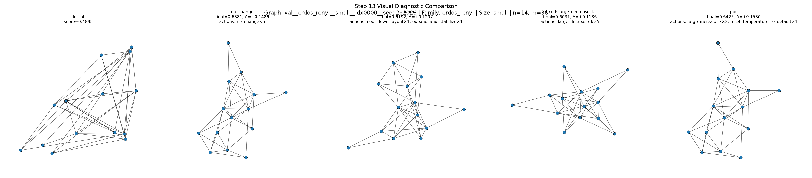
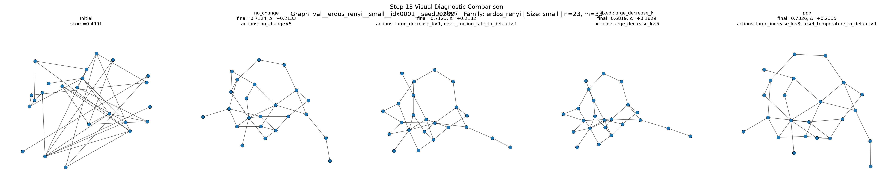
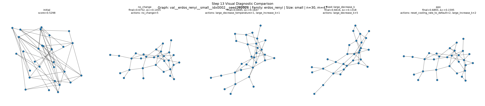

# RL-Based Parameter Control for Force-Directed Graph Layouts

This project develops a **single-agent reinforcement learning (SARL) framework** for automatic parameter control in force-directed graph drawing algorithms.

The main idea is simple:

> Given an arbitrary graph and an evolving layout, a reinforcement learning agent learns how to adjust force-directed layout parameters so that the final drawing becomes more aesthetically pleasing.

The agent does **not** move graph nodes directly. Instead, it controls layout parameters such as:

* ideal edge length / spacing parameter `k`
* temperature
* cooling rate

The force-directed algorithm remains responsible for moving the nodes.

---

## 1. Motivation

Force-directed graph drawing algorithms are widely used because they are intuitive and visually effective. However, their output is sensitive to:

* parameter settings
* graph structure
* initial layout
* graph size
* graph density
* number of iterations

A parameter setting that works well for one graph may not work well for another graph. Therefore, this project investigates whether reinforcement learning can automatically learn graph-aware and layout-aware parameter control policies.

---

## 2. Current Research Direction

This framework formulates force-directed parameter tuning as a SARL problem.

At each macro-step:

1. A graph layout is observed.
2. The RL agent selects a parameter-control action.
3. The force-directed algorithm runs for several iterations using the updated parameters.
4. Layout quality is evaluated.
5. A reward is computed based on layout improvement.
6. The process repeats until the episode ends.

The goal is to learn a policy that generalizes across graph families and graph sizes.

---

## 3. Framework Overview

The implemented framework contains the following major components:

```text
graph dataset
    ↓
force-directed algorithm
    ↓
layout-quality metrics
    ↓
state builder
    ↓
RL action space
    ↓
reward function
    ↓
Gymnasium environment
    ↓
PPO training and evaluation
    ↓
baseline and visual comparison
```

---

## 4. Implemented Components

### 4.1 Graph Dataset Layer

The graph-data layer supports synthetic graph generation, saving, loading, and dataset splitting.

Implemented graph families include:

* Erdős–Rényi graphs
* Barabási–Albert graphs
* Watts–Strogatz graphs
* trees
* grid graphs
* bipartite graphs
* random geometric graphs
* clustered/community graphs

The dataset is divided into:

```text
train
val
test_seen
test_unseen_size
test_unseen_family
```

This allows us to evaluate whether the learned policy generalizes beyond the training distribution.

---

### 4.2 Force-Directed Algorithm Layer

The current implementation uses a pure Fruchterman-Reingold-style force-directed algorithm.

The controllable parameters are:

```text
k
temperature
cooling_rate
```

The project is structured so that other force-directed algorithms can be added later using the same interface.

---

### 4.3 Layout-Quality Metrics

The framework currently evaluates graph layouts using four core aesthetic metrics:

1. **Crossing count**
2. **Angular resolution**
3. **Edge-length variation**
4. **Node separation**

These are combined into a normalized layout score.

The crossing metric was updated to use a more standard crossing upper-bound normalization that excludes adjacent edge pairs from the possible crossing count.

---

### 4.4 Static Graph Representation

The state includes graph-level structural information.

Implemented static features include:

* number of nodes
* number of edges
* density
* degree statistics
* degree entropy
* leaf fraction
* hub fraction
* clustering coefficient
* transitivity
* average shortest path length
* graph diameter
* global efficiency
* tree indicator
* bipartite indicator
* planarity indicator
* core-number statistics
* degree assortativity
* modularity approximation

A compact spectral graph embedding is also included using adjacency and Laplacian spectral summaries.

---

### 4.5 Dynamic Layout-State Representation

The state also includes dynamic layout information, such as:

* current layout-quality scores
* crossing distribution
* node-separation condition
* edge-length condition
* layout movement and convergence indicators
* recent score changes
* recent action history

This makes the state graph-aware, layout-aware, dynamics-aware, conflict-aware, and history-aware.

---

### 4.6 Final SARL State

The final observation vector is:

```text
s_t = [
    G_h,
    G_e,
    P_t,
    A_t,
    ΔA_t,
    D_t,
    C_t,
    H_t
]
```

where:

| Symbol | Meaning                               |
| ------ | ------------------------------------- |
| `G_h`  | handcrafted graph descriptors         |
| `G_e`  | compact graph embedding               |
| `P_t`  | current algorithm-parameter state     |
| `A_t`  | current layout-quality state          |
| `ΔA_t` | recent layout-quality change          |
| `D_t`  | layout dynamics and convergence state |
| `C_t`  | crossing/conflict distribution        |
| `H_t`  | recent action history                 |

---

### 4.7 Parameter-Control Action Space

The action space is discrete and parameter-based.

The agent can choose actions such as:

```text
no_change
small_increase_k
small_decrease_k
large_increase_k
large_decrease_k
small_increase_temperature
small_decrease_temperature
large_increase_temperature
large_decrease_temperature
small_increase_cooling_rate
small_decrease_cooling_rate
large_increase_cooling_rate
large_decrease_cooling_rate
expand_and_explore
expand_and_stabilize
compress_and_stabilize
reheat_layout
cool_down_layout
reset_k_to_default
reset_temperature_to_default
reset_cooling_rate_to_default
```

The agent only changes parameters. It does not directly move nodes.

---

### 4.8 Reward Function

The reward function is based on balanced layout-quality improvement.

It considers:

* crossing-score improvement
* angular-resolution improvement
* edge-length-score improvement
* node-separation improvement
* excessive expansion penalty
* repeated-action penalty
* small action-change penalty
* terminal layout-quality bonus

This reward is designed to avoid degenerate behavior such as repeatedly increasing or decreasing one parameter without meaningful layout improvement.

---

### 4.9 Gymnasium Environment

A complete Gymnasium-compatible environment has been implemented.

Each episode corresponds to one graph-layout optimization process.

At each step:

```text
agent selects parameter action
→ parameters are updated
→ force-directed algorithm runs
→ layout metrics are computed
→ reward is computed
→ next state is returned
```

This environment is compatible with Stable-Baselines3 PPO.

---

## 5. PPO Training and Evaluation

The first PPO training pipeline has been implemented using Stable-Baselines3.

The current training/evaluation setup supports:

* PPO training
* PPO model saving/loading
* validation evaluation
* random-policy evaluation
* fixed-action baseline evaluation
* no-change/default-FR baseline evaluation
* visual comparison of layouts

---

## 6. Baselines

The framework currently compares PPO against:

| Baseline                  | Description                                                |
| ------------------------- | ---------------------------------------------------------- |
| `no_change`               | Default force-directed algorithm with no parameter changes |
| `random`                  | Random parameter-control actions                           |
| `fixed::large_decrease_k` | Always apply `large_decrease_k`                            |
| `ppo`                     | Learned PPO policy                                         |

The `no_change` baseline is important because it represents the default force-directed algorithm behavior.

---

## 7. Current Diagnostic Findings

Early debug training showed policy collapse, where PPO selected only:

```text
large_decrease_k
```

After longer training, the PPO policy became more meaningful and began selecting actions such as:

```text
large_increase_k
reset_temperature_to_default
reset_cooling_rate_to_default
```

This indicates that the policy is no longer simply copying a fixed action.

Current diagnostic results show that PPO is promising and ready for systematic experimental evaluation, but final claims require larger multi-seed experiments.

---

## 8. Visual Diagnostic Comparison

Step 13 added visual comparison of layout outputs.

Each visual comparison uses the same graph and same initial layout seed across policies.

The comparison includes:

```text
Initial layout
No-change/default FR
Random policy
Fixed large_decrease_k
PPO policy
```

Example visual outputs are saved in:

```text
outputs/visuals/
```

Example figure paths:

```text
outputs/visuals/policy_visual_comparison_graph_0_val__erdos_renyi__small__idx0000__seed202026.png
outputs/visuals/policy_visual_comparison_graph_1_val__erdos_renyi__small__idx0001__seed202027.png
outputs/visuals/policy_visual_comparison_graph_2_val__erdos_renyi__small__idx0002__seed202028.png
```

Example visual comparison:







---

## 9. Project Structure

```text
rl_fd_parameter_control/
│
├── actions/
│   ├── base_action_space.py
│   ├── parameter_actions.py
│   └── action_registry.py
│
├── agents/
│   ├── ppo_trainer.py
│   └── evaluator.py
│
├── algorithms/
│   ├── base.py
│   └── fruchterman_reingold.py
│
├── data/
│   ├── metadata/
│   └── processed/
│
├── envs/
│   ├── fd_param_control_env.py
│   ├── env_factory.py
│   └── layout_context.py
│
├── experiments/
│   ├── train.py
│   ├── evaluate.py
│   ├── compare_baselines.py
│   └── visual_compare.py
│
├── features/
│   ├── graph_features.py
│   ├── graph_embedding.py
│   ├── layout_features.py
│   ├── dynamics_features.py
│   ├── conflict_features.py
│   ├── history_features.py
│   └── normalizers.py
│
├── graph_data/
│   ├── generators.py
│   ├── splits.py
│   ├── io.py
│   └── dataset_builder.py
│
├── metrics/
│   ├── crossings.py
│   ├── angular_resolution.py
│   ├── edge_lengths.py
│   ├── node_separation.py
│   ├── layout_quality.py
│   └── layout_score.py
│
├── rewards/
│   ├── base_reward.py
│   ├── aesthetic_delta_reward.py
│   └── reward_registry.py
│
├── states/
│   ├── state_schema.py
│   ├── state_builder.py
│   └── state_registry.py
│
├── tests/
│   ├── test_graph_data.py
│   ├── test_graph_features.py
│   ├── test_dynamic_features.py
│   ├── test_state_builder.py
│   ├── test_action_space.py
│   ├── test_reward.py
│   ├── test_environment.py
│   ├── test_ppo_training.py
│   ├── test_baseline_evaluation.py
│   └── test_visual_comparison.py
│
├── visualization/
│   ├── layout_runner.py
│   ├── layout_plotter.py
│   └── compare_policies.py
│
├── requirements.txt
└── README.md
```

---

## 10. How to Run

### 10.1 Build the graph dataset

```bash
python -m graph_data.dataset_builder
```

### 10.2 Test the main components

```bash
python -m tests.test_graph_data
python -m tests.test_graph_features
python -m tests.test_dynamic_features
python -m tests.test_state_builder
python -m tests.test_action_space
python -m tests.test_reward
python -m tests.test_environment
```

### 10.3 Train PPO

```bash
python -m experiments.train
```

### 10.4 Evaluate PPO

```bash
python -m experiments.evaluate
```

### 10.5 Compare against baselines

```bash
python -m experiments.compare_baselines
```

### 10.6 Generate visual comparisons

```bash
python -m experiments.visual_compare
```

---

## 11. Current Status

The framework has completed the core development phase.

Completed:

* graph dataset generation
* force-directed algorithm interface
* layout-quality metrics
* static graph features
* spectral graph embedding
* dynamic layout features
* final SARL state builder
* multi-scale parameter-control action space
* balanced aesthetic reward
* Gymnasium environment
* PPO training pipeline
* baseline comparison
* visual diagnostic comparison

Current status:

> The project is ready to move into systematic actual experiments.

The next phase should train and evaluate multiple PPO models across random seeds and dataset splits.

---

## 12. Next Experimental Phase

The next planned experiments should include:

1. Train PPO with multiple random seeds.
2. Evaluate on:

   * validation graphs
   * seen-family test graphs
   * unseen-size test graphs
   * unseen-family test graphs
3. Compare against:

   * no-change/default FR
   * random policy
   * fixed-action policies
4. Report:

   * mean final layout score
   * mean layout-score improvement
   * standard deviation
   * action distribution
   * family-wise performance
   * visual examples
5. Perform ablation studies:

   * without graph embedding
   * without history features
   * without conflict features
   * without dynamics features

---

## 13. Research Contribution

The main contribution of this project is a general SARL-based framework for parameter control in force-directed graph layout algorithms.

Unlike node-level MARL graph drawing methods, this framework:

* uses one global RL agent
* controls algorithm parameters instead of moving nodes directly
* preserves the force-directed layout mechanism
* uses graph-aware and layout-aware state representation
* supports graph-family and graph-size generalization evaluation
* can be extended to multiple force-directed algorithms

---

## 14. Notes

This repository is currently under active development.

The current implementation focuses on Pure Fruchterman-Reingold parameter control. The framework is designed to support additional force-directed algorithms in future experiments.
